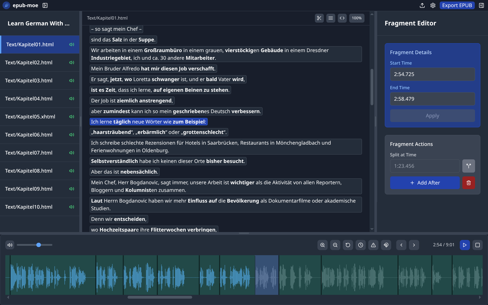
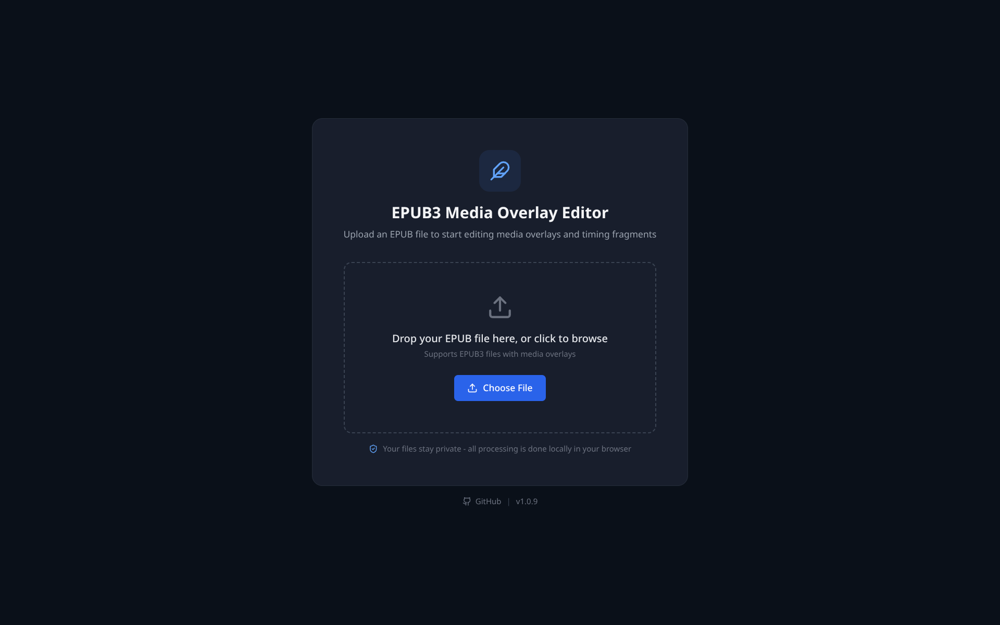
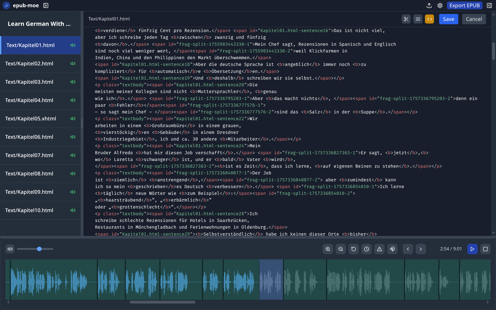

# EPUB Media Overlay Editor (epub-moe)

A React-based tool for fine-tuning synchronized text and audio in EPUB files (aka "TalkingBooks").

## What This Is

I built epub-moe because I needed surgical precision when creating German language learning books with synchronized audio. Existing tools like [Storyteller](https://gitlab.com/storyteller-platform/storyteller) are excellent for initial auto-synchronization, but sometimes you need more granual control, especially for educational content where precise timing matters.

> [!NOTE]
> This tool is designed for **fine-tuning existing media overlays**, not creating them from scratch.



## Online Access

You can access the latest build directly in your browser at [https://epub-moe.pages.dev/](https://epub-moe.pages.dev/) without any installation.

## What This Does Well

- **Drag and drop audio regions**: Move boundaries directly on the waveform until timing is pixel-perfect
- **Text-to-audio linking**: Select text fragments to instantly hear their corresponding audio and vice versa  
- **Fine-tune fragments**: Edit timing values precisely, delete unwanted fragments directly from the GUI
- **Inline HTML editing**: Make quick adjustments to highlight placement without leaving the app
- **Fragment splitting**: Break up sprawling sentences into digestible chunks
- **EPUB-centric workflow**: Load EPUB, edit, export EPUB - no format conversion hell and no audio re-encoding (!)

## What This Doesn't Do

- **Auto-synchronization**: Use [Storyteller](https://gitlab.com/storyteller-platform/storyteller) or similar tools first
- **EPUB creation**: Assumes you already have an EPUB with basic media overlay structure
- **Full-featured EPUB editing**: This is a personal tool that solved my specific problem. It is narrowly focused by design. For complete EPUB authoring/editing I recommend using [Sigil](https://sigil-ebook.com/)
- **Enterprise features**: No user management, cloud sync, collaboration, etc.

## Built By

My name is André Klein. I'm an independent publisher of German learning materials at [LearnOutLive](https://learnoutlive.com), including EPUB "TalkingBooks" with media overlays. This tool exists because I needed something that could fine-tune media overlays with precision, and existing solutions weren't cutting it. It's built for my specific workflow, but maybe it'll work for yours too.

[Read the full backstory here.](https://andreklein.net/why-i-built-my-own-epub-media-overlay-editor/)

## Compatibility & Requirements

Epub-moe has been tested with "TalkingBooks" that Storyteller Version 1.3.6 generates. I've also tested it with EPUB exports from other tools like Tobi.


> [!IMPORTANT]
> For the audio timing to be perfect, it is recommended to use constant bit rate MP3s. When using MP3s with variable bit rate, there is a drift over time due to how web audio libraries handle VBR files.
>
> Personally I'd skip MP3 altogether and use a modern container like MP4 with OPUS codec instead — better quality at the same bitrate and smaller files. Caveat: may not work on some older hardware.

## Installation & Setup

```bash
git clone https://github.com/burninc0de/epub-moe
cd epub-moe
npm install
npm run dev
```

Open [http://localhost:5173](http://localhost:5173) in your browser.

### Auto-loading an EPUB during development

To skip the upload screen each time the dev server reloads, drop your EPUB at the project root (or in `public/`) and set the `VITE_AUTO_LOAD_EPUB` environment variable. Vite serves project-root files in dev, so it works without moving the file into `public/`:

```bash
VITE_AUTO_LOAD_EPUB=/dld9_tb_preview.epub npm run dev
```

Or add it to a `.env.development.local` file:

```
VITE_AUTO_LOAD_EPUB=/dld9_tb_preview.epub
```

Note: only files in `public/` are copied into the production build, so root-level EPUBs are a dev-only convenience.

## Testing

Smoke tests use [Playwright](https://playwright.dev/) against the production build and cover the basics: EPUB opens, waveform renders, HTML editor opens, and EPUB exports.

```bash
npm test
```

They need a test fixture EPUB at the project root. Download the public single-chapter preview (from the preview portal at [books.learnoutlive.com](https://books.learnoutlive.com)):

```bash
curl -O https://preview.learnoutlive.com/epubs/dld9_tb_preview.epub
npm test
```

If the fixture is missing, the tests skip with a clear message. The fixture is gitignored, so anyone cloning the repo needs to download it once.

## Usage

1. **Load EPUB**: Drag and drop an EPUB file with existing media overlay structure
2. **Select chapter**: Choose the chapter you want to edit from the left panel
3. **Fine-tune timing**: Click on text fragments or audio regions to adjust boundaries
4. **Edit if needed**: Use the HTML editor for quick text adjustments  
5. **Export**: Download the updated EPUB with your changes

### Toolbar Features

- **Scissors icon (Cut Tool)**: Split text fragments at desired points with intelligent word-boundary snapping
  - **Single click**: Activate/deactivate the cut tool
  - **Double-click**: Toggle sticky mode (keeps tool active for multiple cuts)
  - **Color states**: Gray (inactive), Blue (single-use), Orange (sticky mode)
  - **Smart splitting**: Automatically snaps to nearest word boundary (spaces/hyphens) to prevent mid-word cuts
  - When you split a text fragment, the corresponding audio is automatically split as well
- **Display toggle**: Switch between line display (fragments appear as separate lines for easier parsing) and flow text (fragments flow naturally with text)
- **Code icon**: Toggle HTML source editing mode for direct markup adjustments

### Waveform Controls

- **Play/Pause**: Click the play button or press **Spacebar** to toggle audio playback
- **Next/Previous**: Navigate between audio fragments with the arrow buttons (or left/right arrow keys, disabled when HTML editor active)
- **Orange timer icon (Apply Time Offset)**: Shift all fragments from a chosen timestamp by a positive or negative time offset
- **Magnet icon (Snap Toggle)**: Controls boundary auto-snapping while dragging waveform regions
  - Gray = snap enabled (default behavior)
  - Red = snap disabled (free boundary dragging)
- **Red warning icon (Force Align)**: Rebuilds all fragment timings based on text sequence order
  - Text fragment order is treated as the single source of truth
  - Timings are rewritten to create continuous coverage from start to end of the audio
  - No overlaps and no gaps remain after force align

## Screenshots

### Upload Screen


### Main Workspace


### HTML Editor


## Known Limitations

- Built around my production workflow — it solves my EPUBs, likely yours too
- Error handling is pragmatic; tested against Storyteller and Tobi exports, and the smoke-test fixture
- No undo functionality (export often!)
- Single-user, local-only (no cloud features)

## Contributing

This project is actively used to produce and maintain real EPUB titles. It's maintained by one person, so:

- Pull requests are welcome and reviewed, but response times vary
- Issues are read and acted on as time allows
- If it doesn't work with your EPUB, report it — if you can share a minimal reproduction, even better
- No contribution guidelines beyond: keep the tests green, build before submitting

## Technical Stack

- React
- WaveSurfer.js for audio waveforms
- JSZip for EPUB parsing
- Standard web APIs

## License

MIT - Use it however you want. If it helps you create better accessible content, even better.

## Acknowledgments

- [Storyteller](https://gitlab.com/storyteller-platform/storyteller) by Shane Friedman - excellent auto-sync tool
- The broader EPUB community dedicated to working on everything SMIL/Media Overlays
- Everyone building open source tools that made this possible

---

*"There are dozens of us who care about EPUB media overlays. Dozens!"*
